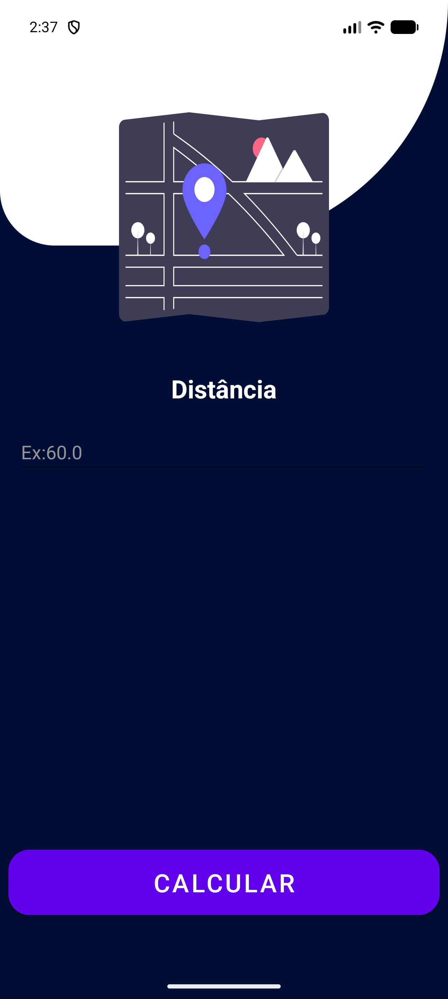
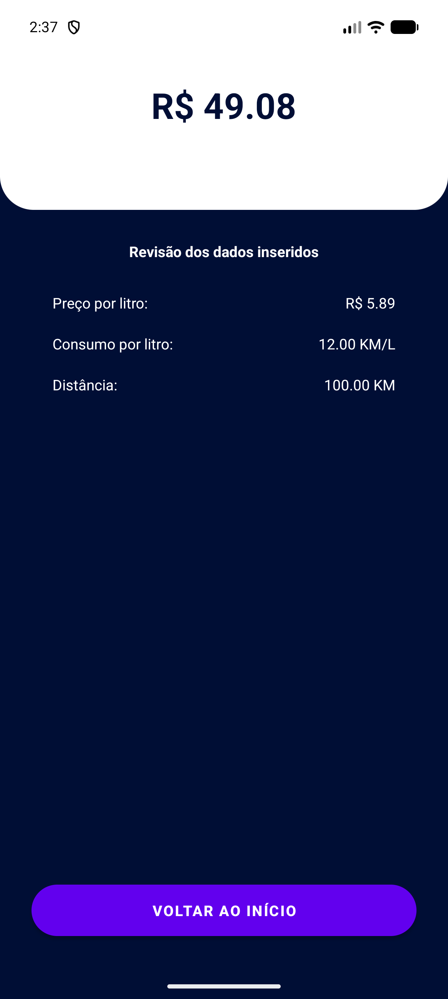

# FuelCalculator 🚗⛽

[Português](#português) | [English](#english)

---

## English

**FuelCalculator** is an Android application developed in Kotlin that helps drivers plan their trips financially. It calculates the total fuel cost based on the price per liter, the vehicle's average consumption, and the distance to be traveled.

### 🚀 Features

- **Trip Cost Calculation:** Find out exactly how much you will spend on fuel.
- **Step-by-Step Flow:** Intuitive interface that guides the user through data entry.
- **Detailed Summary:** Clear display of entered values and the final result on the conclusion screen.

### 📸 Screenshots

| Start | Price | Consumption | Distance | Result |
|---|---|---|---|---|
|  |  |  |  |  |

### 🛠️ Technologies Used

- **Language:** [Kotlin](https://kotlinlang.org/)
- **Interface:** XML Layouts with *Edge-to-Edge* support.
- **Architecture:** Based on Activities with navigation via Intents.
- **Tools:** Android Studio, Android SDK.

### 📱 How to use

The app follows a linear flow of screens:

1. **Start:** Welcome screen to begin the calculation.
2. **Fuel Price:** Enter the current value per liter of fuel (e.g., $ 5.89).
3. **Consumption per Liter:** Enter the average kilometers your car does per liter (e.g., 12 km/L).
4. **Distance:** Type the total distance of the trip in kilometers.
5. **Result:** View the estimated total cost and review the entered data.

### 🔧 Project Structure

The project is organized into the following main Activities:
- `MainActivity`: Entry point.
- `PrecoCombustivelActivity`: Collection of fuel price.
- `ConsumoPorLitroActivity`: Collection of average consumption.
- `DistanciaActivity`: Collection of trip distance.
- `ResultadoActivity`: Final calculation and results display.

### 📥 Installation and Execution

1. Clone the repository:
   ```bash
   git clone https://github.com/YOUR_USERNAME/FuelCalculator.git
   ```
2. Open the project in **Android Studio**.
3. Sync Gradle.
4. Run on an Emulator or physical device with Android 5.0 (Lollipop) or higher.

---

## Português

O **FuelCalculator** é um aplicativo Android desenvolvido em Kotlin que ajuda motoristas a planejar financeiramente suas viagens. Ele calcula o custo total de combustível com base no preço por litro, consumo médio do veículo e a distância a ser percorrida.

### 🚀 Funcionalidades

- **Cálculo de Custo de Viagem:** Descubra exatamente quanto você vai gastar de combustível.
- **Fluxo Passo a Passo:** Interface intuitiva que guia o usuário através da inserção de dados.
- **Resumo Detalhado:** Exibição clara dos valores inseridos e do resultado final na tela de conclusão.

### 📸 Telas do Aplicativo

| Início | Preço | Consumo | Distância | Resultado |
|---|---|---|---|---|
|  |  |  |  |  |

### 🛠️ Tecnologias Utilizadas

- **Linguagem:** [Kotlin](https://kotlinlang.org/)
- **Interface:** XML Layouts com suporte a *Edge-to-Edge*.
- **Arquitetura:** Baseada em Activities com navegação via Intents.
- **Ferramentas:** Android Studio, Android SDK.

### 📱 Como usar

O aplicativo segue um fluxo linear de telas:

1. **Início:** Tela de boas-vindas para iniciar o cálculo.
2. **Preço do Combustível:** Informe o valor atual do litro do combustível (ex: R$ 5,89).
3. **Consumo por Litro:** Insira a média de quilômetros que seu carro faz por litro (ex: 12 km/L).
4. **Distância:** Digite a distância total da viagem em quilômetros.
5. **Resultado:** Visualize o custo total estimado e revise os dados inseridos.

### 🔧 Estrutura do Projeto

O projeto é organizado nas seguintes Activities principais:
- `MainActivity`: Ponto de entrada.
- `PrecoCombustivelActivity`: Coleta do preço do combustível.
- `ConsumoPorLitroActivity`: Coleta do consumo médio.
- `DistanciaActivity`: Coleta da distância da viagem.
- `ResultadoActivity`: Cálculo final e exibição dos resultados.

### 📥 Instalação e Execução

1. Faça o clone do repositório:
   ```bash
   git clone https://github.com/SEU_USUARIO/FuelCalculator.git
   ```
2. Abra o projeto no **Android Studio**.
3. Sincronize o Gradle.
4. Execute em um Emulador ou dispositivo físico com Android 5.0 (Lollipop) ou superior.

---
Developed as an Android development learning project / Desenvolvido como um projeto de aprendizado em desenvolvimento Android.
